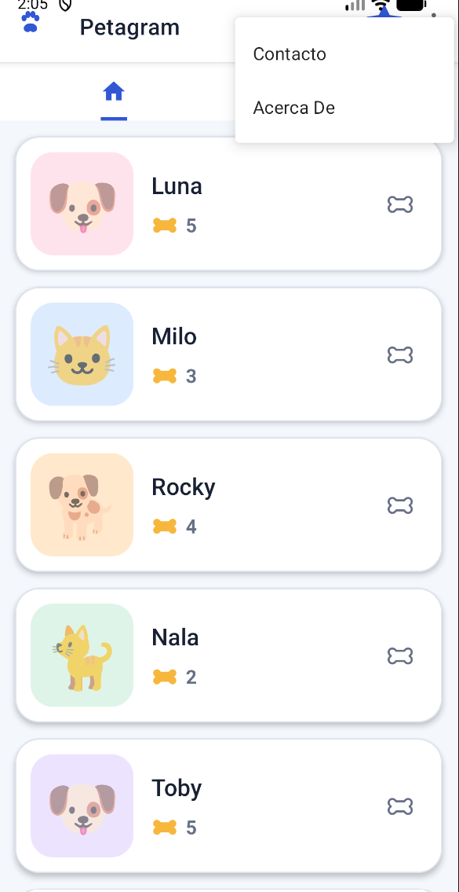
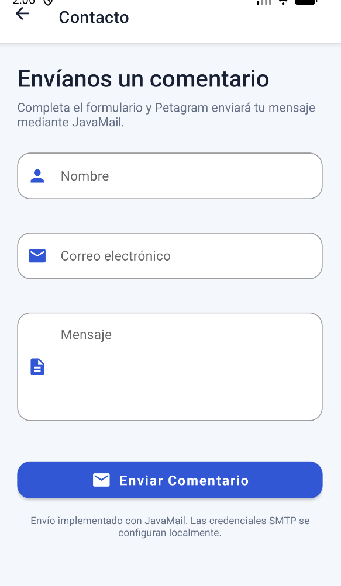
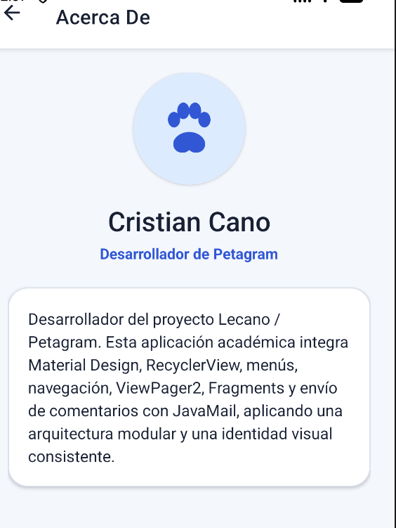
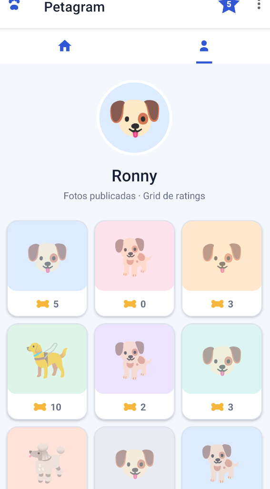

# Lecano · Petagram — Menús y Fragments

Esta rama extiende la actividad anterior de **Petagram** incorporando **menús, ViewPager2, Fragments, perfil de mascota y JavaMail**, manteniendo el RecyclerView, ratings y favoritos desarrollados previamente.

## Rama de esta actividad

```text
actividad-menus-fragments
```

La rama parte de `actividad-mascotas`, por lo que las entregas anteriores permanecen separadas.

## Menú de opciones

El menú de tres puntos contiene los dos elementos solicitados:

- **Contacto**
- **Acerca De**

La estrella de las 5 mascotas favoritas se conserva como Action View.

### Contacto

`ContactActivity` contiene un formulario Material Design con:

- Nombre
- Correo electrónico
- Mensaje
- Botón **Enviar Comentario**

Los campos utilizan `TextInputLayout` y `TextInputEditText`.

El envío está implementado con **JavaMail para Android**:

```kotlin
implementation("com.sun.mail:android-mail:1.6.7")
implementation("com.sun.mail:android-activation:1.6.7")
```

Las credenciales **no se guardan en GitHub**. Para probar el envío real agrega al archivo local `local.properties`:

```properties
SMTP_USER=tu_correo@gmail.com
SMTP_PASSWORD=tu_app_password
SMTP_TO=correo_destino@gmail.com
SMTP_HOST=smtp.gmail.com
SMTP_PORT=587
```

Para Gmail se recomienda usar una **contraseña de aplicación**, nunca la contraseña principal de la cuenta.

### Acerca De

`AboutActivity` muestra la bio del desarrollador y permite regresar a la pantalla principal.

## Fragments y ViewPager2

La pantalla principal fue modularizada usando **ViewPager2** y dos Fragments:

```text
MainActivity
└── ViewPager2
    ├── PetsFragment
    │   └── RecyclerView de mascotas
    └── ProfileFragment
        ├── Foto circular
        └── RecyclerView Grid de publicaciones
```

### PetsFragment

Contiene el RecyclerView principal de Petagram, mantiene el sistema de rating con huesos y el FloatingActionButton para volver al inicio.

### ProfileFragment

Muestra:

- Foto circular de perfil
- Nombre de la mascota: **Ronny**
- Grid de 3 columnas
- 9 publicaciones dummy
- Cantidad de ratings representada con huesos

Para la imagen circular se implementó:

```kotlin
implementation("com.mikhaellopez:circularimageview:4.3.1")
```

## Estructura principal

```text
app/src/main/java/com/example/lecano/
├── MainActivity.kt
├── MainPagerAdapter.kt
├── PetsFragment.kt
├── ProfileFragment.kt
├── PetPhoto.kt
├── PetPhotoAdapter.kt
├── ContactActivity.kt
├── AboutActivity.kt
├── MailSender.kt
├── Mascota.kt
├── MascotaData.kt
├── MascotaAdapter.kt
└── FavoritesActivity.kt
```

Layouts agregados:

```text
app/src/main/res/layout/
├── activity_main.xml
├── fragment_pets.xml
├── fragment_profile.xml
├── item_profile_photo.xml
├── activity_contact.xml
└── activity_about.xml
```

## Criterios de evaluación cubiertos

- ✅ Menú **Contacto**
- ✅ Menú **Acerca De**
- ✅ Acciones de ambos menús
- ✅ Formulario con Material Design
- ✅ JavaMail implementado
- ✅ ViewPager2
- ✅ Modularización en Fragments
- ✅ Fragment de lista de mascotas
- ✅ Fragment de perfil
- ✅ RecyclerView en Grid
- ✅ Foto circular mediante librería
- ✅ Ratings dummy con huesos
- ✅ Se conserva la pantalla de 5 favoritas

## Evidencias

### Menú de opciones y Fragment principal

Se observa Petagram con el `ViewPager2`, el Fragment de lista de mascotas y el menú de opciones desplegado con **Contacto** y **Acerca De**.



### Formulario de Contacto

El formulario utiliza componentes de Material Design para nombre, correo y mensaje, además del botón **Enviar Comentario** conectado a la implementación de JavaMail.



### Acerca De

Pantalla con la bio del desarrollador y navegación de regreso a la aplicación.



### Fragment de perfil

Segundo Fragment del `ViewPager2`, con foto circular de **Ronny** y un `RecyclerView` en Grid de tres columnas mostrando publicaciones dummy y ratings con huesos.



Las evidencias de esta actividad están almacenadas en:

```text
docs/screenshots/
├── menus-opciones.png
├── contacto.png
├── acerca-de.png
└── perfil-fragment.png
```

## Descargar esta actividad

```bash
git fetch origin
git switch actividad-menus-fragments
git pull origin actividad-menus-fragments
```

Si ya tienes cambios locales sin guardar:

```bash
git stash
git switch actividad-menus-fragments
git pull origin actividad-menus-fragments
git stash pop
```

## Repositorio

**CristianCanoIng/Lecano**
