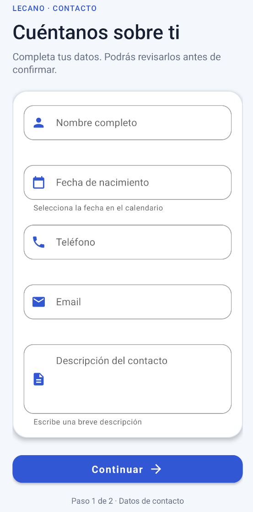
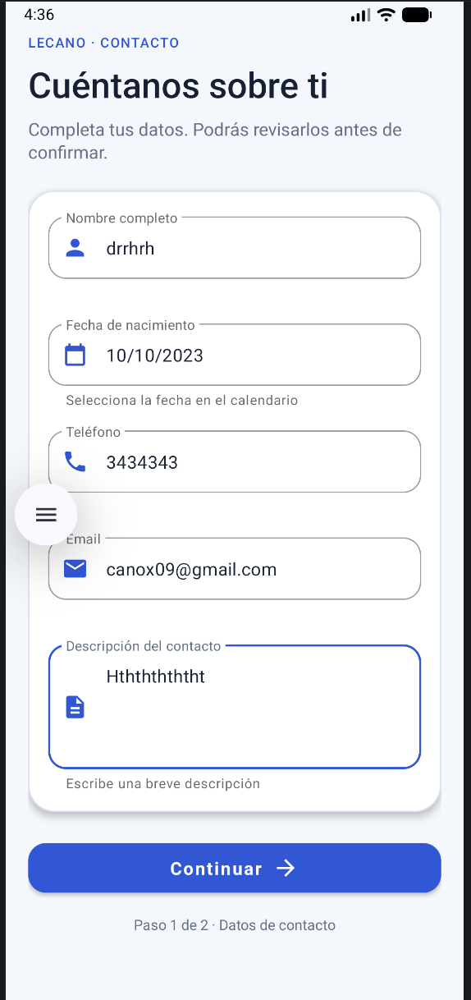
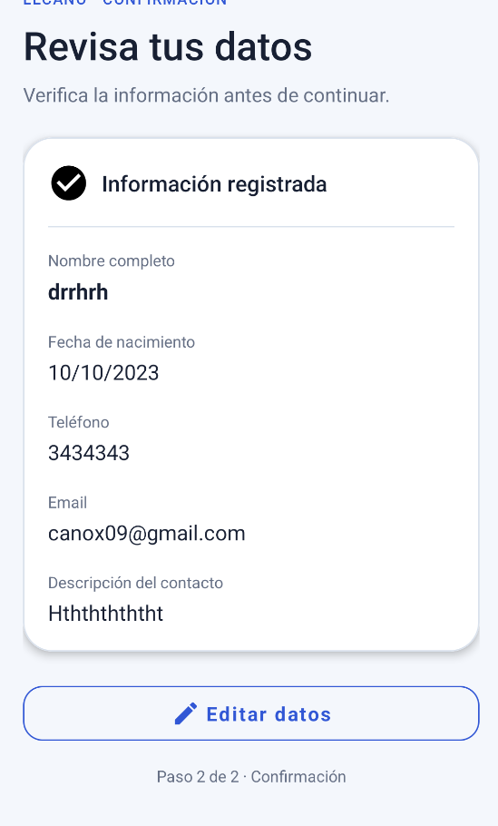

# Lecano

Aplicación Android desarrollada en **Kotlin** para capturar, validar, confirmar y editar datos de contacto mediante dos Activities y componentes de **Material Design**.

## Funcionalidad

La aplicación implementa el flujo completo solicitado:

1. **Formulario de contacto**
   - Nombre completo
   - Fecha de nacimiento mediante `DatePickerDialog`
   - Teléfono
   - Email
   - Descripción del contacto
   - Botón **Continuar**

2. **Confirmación de datos**
   - Visualización de todos los datos ingresados
   - Botón **Editar datos**
   - Retorno al formulario con los campos previamente diligenciados

## Tecnologías utilizadas

- Kotlin
- Android SDK
- Gradle con Kotlin DSL
- Material Components
- `TextInputLayout`
- `TextInputEditText`
- `MaterialButton`
- `DatePickerDialog`
- Activities e Intents
- Animaciones y transiciones XML

## Criterios cumplidos

- ✅ EditText con Material Design
- ✅ Nombre completo
- ✅ Fecha de nacimiento
- ✅ Picker de fecha
- ✅ Teléfono
- ✅ Email
- ✅ Descripción del contacto
- ✅ Validación de campos obligatorios
- ✅ Validación de formato de email
- ✅ Pantalla de confirmación
- ✅ Botón **Editar datos**
- ✅ Datos precargados al volver al formulario
- ✅ Diseño visual personalizado
- ✅ Animaciones de entrada y transición

## Evidencias

### Formulario inicial



### Formulario diligenciado



### Confirmación de datos



Las capturas se encuentran en:

```text
docs/screenshots/
├── formulario-vacio.png
├── formulario-completo.png
└── confirmacion.png
```

## Estructura principal

```text
app/src/main/
├── java/com/example/lecano/
│   ├── MainActivity.kt
│   └── ConfirmationActivity.kt
├── res/
│   ├── anim/
│   ├── drawable/
│   ├── layout/
│   │   ├── activity_main.xml
│   │   └── activity_confirmation.xml
│   └── values/
│       ├── colors.xml
│       ├── strings.xml
│       ├── styles.xml
│       └── themes.xml
└── AndroidManifest.xml
```

## Flujo de navegación

```text
Formulario
   ↓ Continuar
Confirmación
   ↓ Editar datos
Formulario con datos precargados
```

Los datos se transfieren entre Activities mediante `Intent` y extras.

## Ejecutar el proyecto

1. Abrir el proyecto en Android Studio.
2. Esperar la sincronización de Gradle.
3. Seleccionar un emulador o dispositivo Android.
4. Ejecutar la aplicación.

## Descargar los últimos cambios

```bash
git switch main
git pull origin main
```

## Clonar por primera vez

```bash
git clone https://github.com/CristianCanoIng/Lecano.git
cd Lecano
```

## Repositorio

**CristianCanoIng/Lecano**
