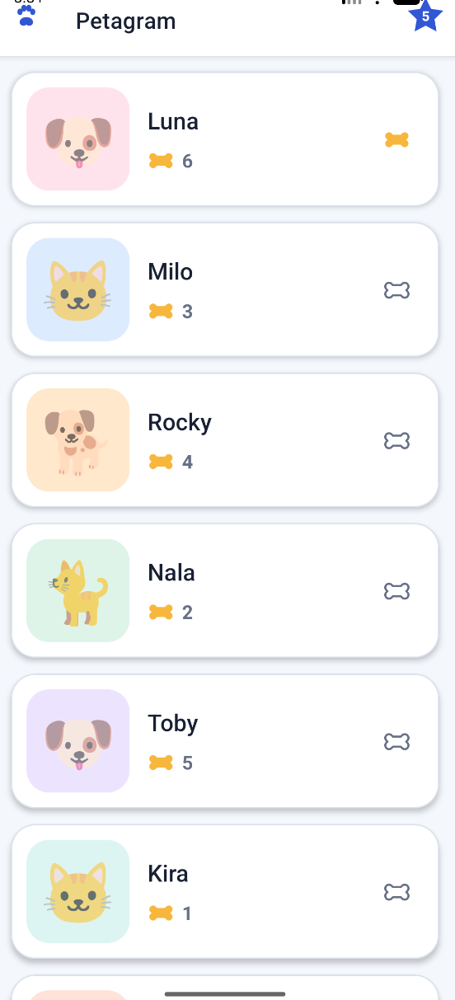
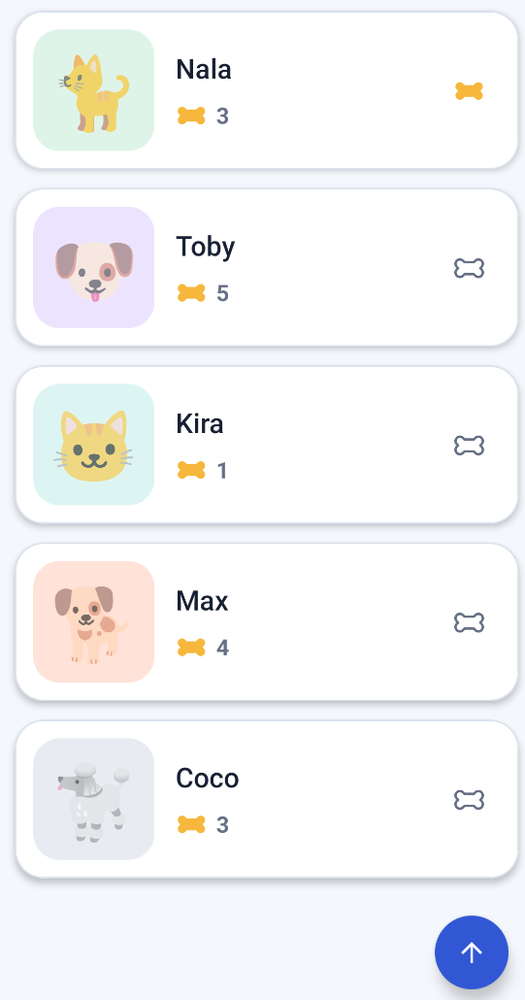
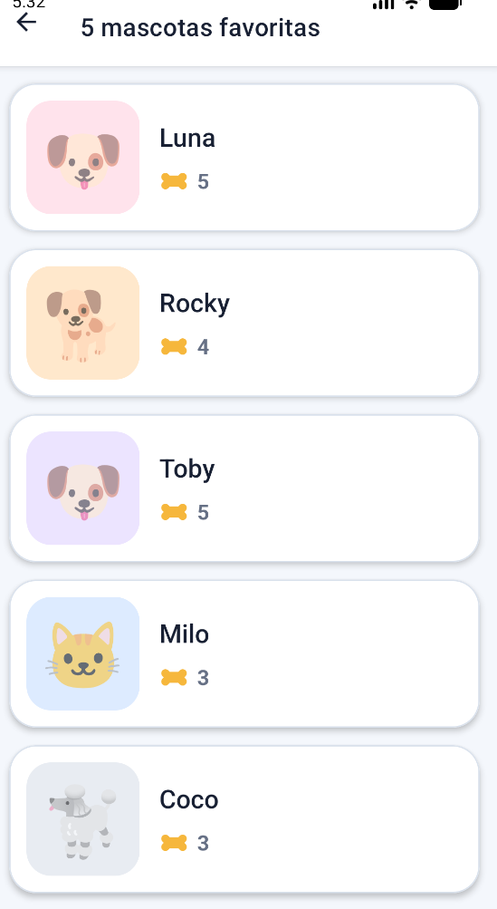

# Lecano · Petagram

Aplicación Android en **Kotlin** que implementa una lista de mascotas con `RecyclerView`, sistema de rating y una pantalla con las últimas 5 mascotas favoritas.

## Parte 1 · Lista de mascotas

La pantalla principal utiliza un `RecyclerView` para mostrar un DataSet de mascotas. Cada item incluye:

- Identidad visual de la mascota
- Nombre
- Rating actual
- Hueso amarillo que representa el rating acumulado
- Hueso de acción para dar un voto a la mascota

Cada mascota puede recibir un voto por sesión desde el hueso de acción. Al votar, el contador aumenta y el hueso cambia de estado.

## Parte 2 · Action View de favoritos

La barra superior contiene un **Action View en forma de estrella** con el número 5.

Al seleccionarlo se abre `FavoritesActivity`, que:

- Muestra exactamente **5 mascotas hardcodeadas**
- Utiliza el mismo `RecyclerView`
- Permite regresar al Activity padre mediante el botón de navegación

La pantalla principal también contiene un **FloatingActionButton** para subir rápidamente al inicio de la lista.

## Arquitectura

```text
app/src/main/java/com/example/lecano/
├── Mascota.kt              # Entidad
├── MascotaData.kt          # DataSet
├── MascotaAdapter.kt       # Adapter + ViewHolder
├── MainActivity.kt         # Lista principal
└── FavoritesActivity.kt    # 5 favoritas
```

Layouts principales:

```text
app/src/main/res/layout/
├── activity_main.xml
├── activity_favorites.xml
├── item_mascota.xml
└── view_action_favorites.xml
```

## Criterios de evaluación cubiertos

- ✅ Proyecto ejecutable
- ✅ DataSet
- ✅ Adapter
- ✅ ViewHolder
- ✅ Clase/layout para los items del RecyclerView
- ✅ Resultado final del RecyclerView
- ✅ Action View de estrella
- ✅ Acción del Action View
- ✅ RecyclerView con 5 items
- ✅ Botón para subir al inicio
- ✅ Rating mediante icono de hueso
- ✅ Navegación de regreso al Activity padre

## Evidencias

### RecyclerView principal y Action View

Se observa la lista principal de mascotas, el rating y la estrella con las 5 favoritas.



### Rating y botón para subir

La lista desplazada evidencia el `RecyclerView`, los huesos de rating y el **FloatingActionButton** para regresar al inicio.



### Activity de 5 mascotas favoritas

La segunda Activity muestra exactamente cinco mascotas y el botón para regresar al Activity padre.



Las evidencias están almacenadas en:

```text
docs/screenshots/
├── petagram-lista-principal.png
├── petagram-rating-boton-subir.png
└── petagram-5-favoritas.png
```

## Flujo

```text
MainActivity
Lista de mascotas
      │
      ├── Hueso → aumenta rating
      │
      ├── FAB ↑ → vuelve al inicio
      │
      └── ⭐ 5
           │
           ▼
FavoritesActivity
5 mascotas hardcodeadas
           │
           └── ← Regresar
```

## Ejecutar

Abre el proyecto en Android Studio, sincroniza Gradle y ejecuta en un emulador o dispositivo Android.

## Descargar esta actividad

```bash
git fetch origin
git switch actividad-mascotas
git pull origin actividad-mascotas
```

## Repositorio

**CristianCanoIng/Lecano**

Rama de esta actividad: **`actividad-mascotas`**
